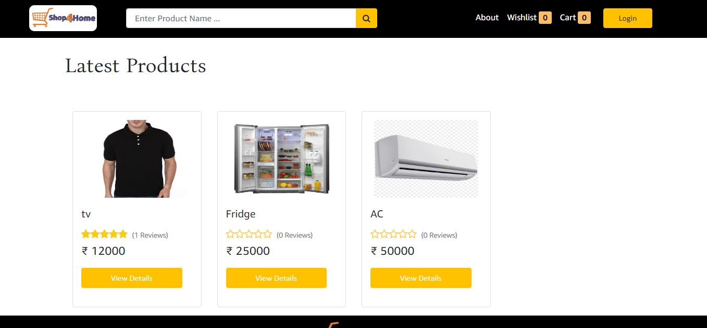

# Shop4Homes
Welcome to Shop4Home. We are dedicated in giving you the very best of our products, with a focus on dependability, customer service and uniqueness. Right from the foundation, Shop4Home has come a long way from its beginnings. When we first started out, our passion for helping other parents be more eco-friendly, providing the best equipment for our fellow musicians drove us todo intense research and gave us the impetus to turn hard work and inspiration into to a booming online store. We now serve customers all over the world and are thrilled to be a part of the quirky,We hope you enjoy our products as much as we enjoy offering them to you.




## Usage

- Create a .env file inside backend/config.

- Copy the following lines and specify appropriate values.

```
PORT = 4000
NODE_ENV = DEVELOPMENT
DB_URI = mongodb+srv://<username>:<password>@mern.apqfp.mongodb.net/<collection-name>?retryWrites=true&
JWT_SECRET =
JWT_EXPIRES_TIME = 7d
COOKIE_EXPIRES_TIME = 7

CLOUDINARY_CLOUD_NAME =
CLOUDINARY_API_KEY =
CLOUDINARY_API_SECRET =

STRIPE_SECRET_KEY =
STRIPE_API_KEY =

SMTP_HOST = smtp.mailtrap.io
SMTP_PORT = 2525
SMTP_EMAIL =
SMTP_PASSWORD =
SMTP_FROM_EMAIL = noreply@shopit.com
SMTP_FROM_NAME = ShopIT
```

Install dependencies

```bash
npm install
cd frontend
npm install
```

### Run App

For running Server

```bash
npm run dev
```

For running Client

```bash
npm start
```
